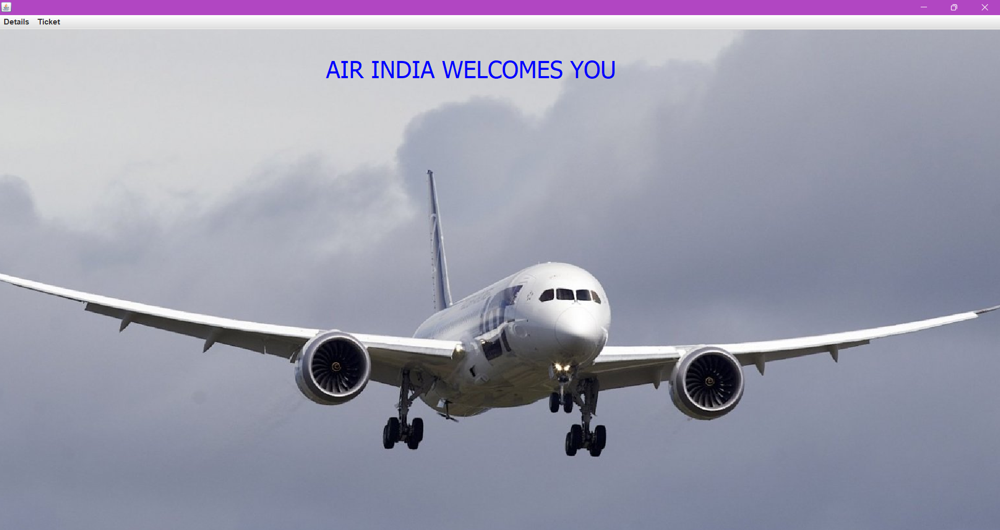
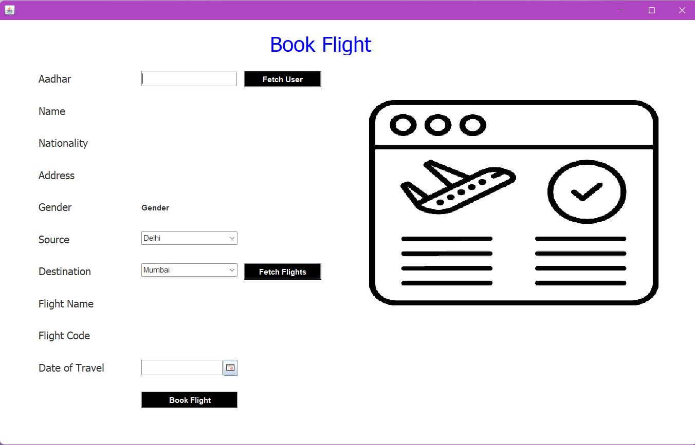
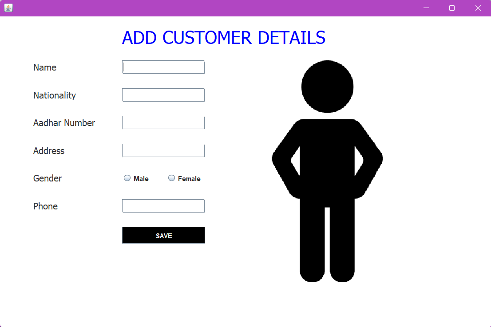
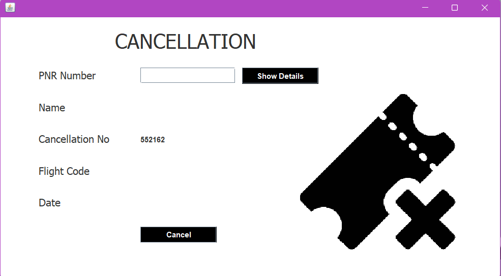

# ✈️ Airline Management System (Java Desktop App)

A GUI-based desktop application designed to manage airline operations such as flight scheduling, customer bookings, and ticket issuance. Built using Java (AWT/Swing) and MySQL for database operations.

---

## 🚀 Features

- 🛫 Add, Update, Delete Flights
- 👤 Manage Customer Details and Bookings
- 🎫 Generate and View Tickets
- 📅 View and Search Flight Schedules
- 🖥️ Responsive Java Swing UI

---

## 🎯 Tech Stack

- **Frontend**: Java AWT/Swing  
- **Backend**: JDBC (Java Database Connectivity)  
- **Database**: MySQL  
- **Tools**: NetBeans / IntelliJ, Git, MySQL Workbench

---

## 📸 Screenshots

### 🔐 Login Page


---

### 🏠 Home / Dashboard


---

### 🛫 Book Flight


---

### 🔍 Add Customer


---

### 🎫 Cancel Ticket


---

## ⚙️ How to Run Locally

```bash
# Clone the repository
git clone https://github.com/farhannaim21/Airline-Management-System.git
cd Airline-Management-System

# Open the project in NetBeans or IntelliJ
# Configure MySQL database using provided schema
# Update DB credentials in JDBC connection (inside Java source code)

# Run the project from your IDE
```

